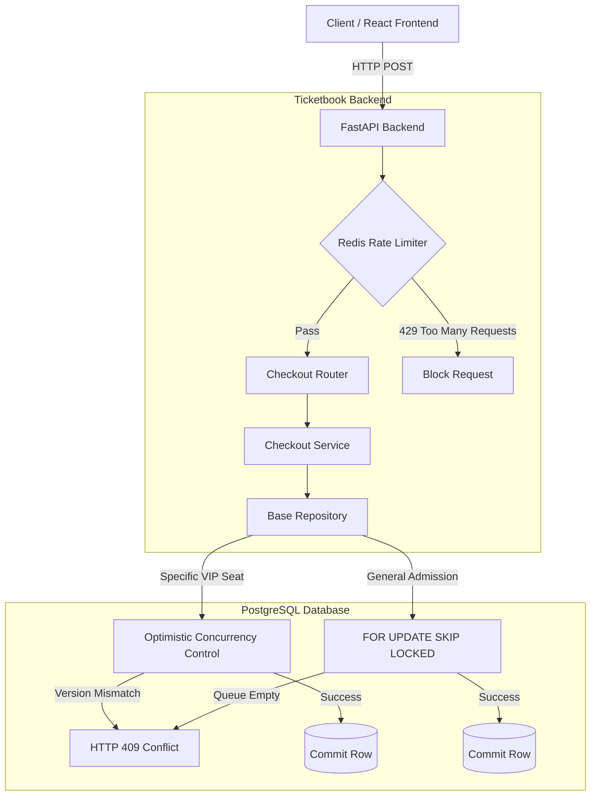

# Ticketbook: High-Concurrency Distributed Reservation Engine

     

A distributed, multi-tenant ticketing and reservation backend engineered from scratch to prevent double-booking and race conditions under massive concurrent load, achieving low-latency ticket assignments using a two-speed database concurrency model.

---

## ⚡ The Core Engineering Problems Solved
When building a system that handles live inventory, the architecture must inherently protect itself from race conditions and leaky boundaries. This backend is engineered to handle edge-cases that crash standard CRUD applications:

1. **The Double-Booking Problem (Race Conditions):** Uses **Optimistic Concurrency Control (OCC)** (`version_id`) to mathematically guarantee that two people buying the same specific VIP seat will not double-book it.
2. **The Database Deadlock Problem:** Uses **`FOR UPDATE SKIP LOCKED`** for General Admission, allowing massive concurrent throughput without table-locking queues.
3. **The Ticket Hoarding / Scalper Problem:** Implements a time-based State Machine (`AVAILABLE` ➔ `RESERVED` ➔ `CONFIRMED`). Unpurchased tickets are naturally released back to the pool after 2 minutes.
4. **The "God-Class" Code Bloat Problem:** Uses **Python Generics (`Generic[T]`)** to build a strongly-typed `BaseRepository`, keeping the database access layer strictly decoupled from business logic.
5. **The Bot-Spike / CPU Starvation Problem:** Mitigates massive login traffic spikes using a **Redis Rate Limiter** and strict PostgreSQL Connection Pooling (`DB_POOL_SIZE = 15`).

### Architecture Flow


---

## 📈 Load Testing & Proven Metrics

I aggressively load-tested the architecture locally using **Locust**, simulating 500 virtual users heavily spamming the endpoints.

**The Results (Locust on a single local machine):**
- Sustained **270+ Requests Per Second (RPS)**.
- **17ms Median Latency** on Optimistic Concurrency Rejections.
- **18ms Median Latency** on SKIP LOCKED Ticket Assignments.
- **Zero Database Crashes** under maximum thread-pool starvation (solved via strict `DB_POOL_SIZE` tuning and multi-worker ASGI setup).

*


*

---

## 🚀 How to Run Locally (One-Click Setup)

This project is fully Dockerized. You do not need to install Python, Node, PostgreSQL, or Redis on your machine.

**1. Clone the Repository:**
```bash
git clone https://github.com/YourUsername/Ticketbook.git
cd Ticketbook
```

**2. Environment Variables:**
If you want to run the project locally without Docker, simply copy `.env.template` to a new `.env` file and set your `JWT_SECRET_KEY`.

**3. Start the entire Stack:**
```bash
docker compose up --build -d
```

**4. Access the Application:**
- **Frontend (React):** [http://localhost:3000](http://localhost:3000)
- **Backend API Docs (Swagger):** [http://localhost:8000/docs](http://localhost:8000/docs)

---

## 🚦 How to run the Load Tests
If you want to verify the concurrency logic yourself:

1. Exec into the backend container or use your local python environment.
2. Run the preparation script to seed 5,000 tickets and 100 users:
   ```bash
   python scripts/prepare_load_test.py
   ```
3. Run Locust:
   ```bash
   locust -f load_tests/locustfile.py
   ```
4. Open the Locust UI at `http://localhost:8089` and start Swarming!

---

## 🤝 Let's Connect
I'm actively documenting my engineering journey and building scalable systems. 
Connect with me on [LinkedIn](https://www.linkedin.com/in/rudresh-gangurde-58208a380/) to discuss backend architecture, database optimization, or new opportunities!
